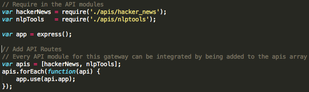
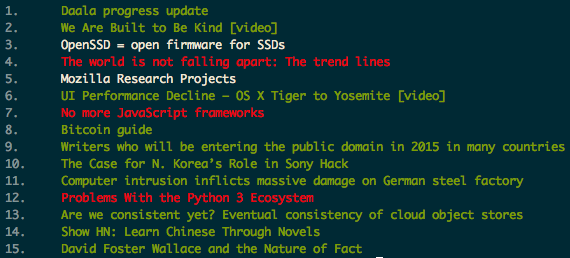

# Mulesoft Gateway Coding Challenge
First off, I'd like to thank Mulesoft for sending me this coding challenge. It was a lot of fun to work on and gave me a small glimpse into the type of software Mulesoft creates.

I completed this challenge using Node.js within the [Express framework](http://expressjs.com/). On top of this, my implementation heavily relies on the [request](https://www.npmjs.com/package/request) npm module. I have also made a small Command Line Application which ties together all the APIs used in the gateway to create something useful.

My implementation has been created with an eye on two key properties:

- Modularity
	- Each API in the gateway should be created separately
- Extensibility
	- Should have the ability add new APIs to the gateway minimal changes to any existing code
	
## Usage

To run the app, you would just need to go into the root directory, and run `node app.js`, assuming you have node.js installed on your machine.

There are 3 APIs that this gateway connects with. They are the [Hacker News API](https://github.com/HackerNews/API), [Clipped's Summarization API](http://www.clipped.me/api.html), and a [Sentiment Analysis API](http://sentiment.vivekn.com/docs/api/). These APIs were chosen because their lack of reliance on API keys, lack of hard set usage restrictions, and ease of use. In addition to these, there is also an endpoint to give usage frequency for each of the API endpoints. Since this is a proxy gateway, the responses do not have a consistent format. The responses are of the format that is specified in the documentation for each of the APIs.

These APIs can be accessed as follows

### Hacker News API Gateway

- Top Stories
	- `GET`
	- `/hacker_news/top`
	- Response
		- Retuns a JSON array of Numbers. Numbers correspond to item IDs for articles on Hacker News. Numbers are indexed by how they are trending on hacker news.

- Get Item
	- `GET`
	- `/hacker_news/item/:itemID`
	- Response
		- Success
			- Returns JSON object containing info about item selected by itemID.
		- Failure
			- Returns JSON object with `"error"` attribute explaining details of error.

- Get Username
	- `GET`
	- `/hacker_news/user/:username`
	- Response
		- Success
			- Returns JSON object containing info about user selected by username
		- Failure
			- Returns JSON object with `"error"` attribute explaining details of error.

### Clipped's Summarization API Gateway
- Summarize Article
	- `GET`
	- `/nlptools/summarize?url=[link to textual content]`
	- Response
		- Success
			- Returns JSON object containing `"summary"` attribute which holds an array of sentences from URL that summarizes the article at it.
		- Failure
			- Returns JSON object with `"error"` attribute explaining details of error.
			- If error is from Clipped API, it will not return JSON object. Must put try-catch around JSON parser to catch this error.

### Sentiment Analysis API Gateway
- Sentiment Analysis of Single Paragraph
	- `POST`
	- `/nlptools/sentiment/single`
	- Request
		- Request body must contain JSON object with `"txt"` attribute that has the string of text to be analyzed
	- Response
		- Success
			- Returns JSON object containing `"result"` attribute which holds another JSON object. `"result"` object contains  `"sentiment"` attribute which indicates the sentiment analysis of the paragraph ("Positive", "Neutral", "Negative"). `"result"` object also contains `"confidence"` attribute which indicates the confidence value of whether the sentiment analysis given is corrent (`Number` from 0-100).
		- Failure
			- Returns JSON object with `"error"` attribute explaining details of error. 

- Sentiment Analysis of Batch of Paragraphs
	- `POST`
	- `/nlptools/sentiment/batch`
	- Request
		- Request body must contain JSON array of texts that need to be analyzed. 
	- Response
		- Success
			- Returns array of JSON objects. Each JSON object contains sentiment analysis for text at corresponding index from request body's text array. Each JSON object contains `"sentiment"` attribute which indicates the sentiment analysis of the paragraph ("Positive", "Neutral", "Negative") and object also contains `"confidence"` attribute which indicates the confidence value of whether the sentiment analysis given is corrent (`Number` from 0-100).
		- Failure
			- Returns JSON object with `"error"` attribute explaining details of error.

### Usage Hit Counts
- Get API Hit Counts
	- `GET`
	- `/usage/:api`
	- Response
		- Returns JSON object with attributes corresponding to endpoints to that API, with their values being the hit count for each endpoint.

## Implementation Details
I will discuss the implementation details by walking through what I did to acheive the two goals of modularity and extensibility.

### Modularity
Since I was already using the express framework, modularity was easy to acheive. Typically, express apps follow the pattern of a single `app.js` file that routes various endpoints to their request handler functions. For example:

    var express = require('express');
    var app = express();
    /*Initialize other settings*/
    var userModule = require('./user_module');
    app.get("/user/:id", userModule.getUser);

This pattern does provide some modularity. The request handlers for a particular resource (users in this case) are written in their own module so at least there is some bit of separation of concerns. But still, all the endpoint routing needs to be done within a single `app.js` file.  Since each resource module has multiple endpoints, the `app.js` file will soon be inflated with a plethora of routing code. Pretty ugly stuff. This is what I was doing before and even though I didn't like it, I stuck with it since I didn't think there would be any way around it.

After watching [this video](http://vimeo.com/56166857) I realized there's a way to alleviate this code congestion. Without getting into the nitty gritty, it basically shows how each module can handle its own routing in addition to providing request handlers. This is done by each module having its own express app (`var moduleApp = express()`). Then in your central `app.js` file, all that is left to do is add `mainApp.use(moduleApp);`. This greatly reduces the lines of code in the `app.js` file. In addition to this, it also allows you to directly see how each endpoint is handled:

    mainApp.get("/user/:id", userModule.getUser); // Before. Decouples request routing and handling
    
    moduleApp.get("/user/:id", function(req,res) {…}); // After

### Extensibility
Since this is supposed to be a gateway to many different APIs, I thought it might be important to be able to add APIs to the gateway without much "collateral damage". That is, without making too many changes to the existing code base. While this seems to go hand in hand with modularity, I would argue that it is still different. While modularity deals with seraration of concerns, extensibility can be seen as the ability to add concerns without too much concern. Modularity certainly helps with extensibility and that is surely the case for my implementation.

With my implementation, the gateway connects with each API through that API's module (the NLP APIs have been coupled into a single module because of their topic similarity and the fact that the biggest difference in connecting to each NLP API was just the endpoint accessed). The problem of extensibility then becomes how to connect that module to the existing code. I was able reduce this step down to 2 lines per API module in the `app.js` file.

To add a new API module, you just `require` it in, and add it to the  `apis` array's initializer list. The simplicity of this step is what satisfies my extensibility requirement.

Each API module is an instance of an `APIModule` object. This is a custom object I created to abstract away all the boilerplate code associated with creating an API module (instantiates the express app, and starts the periodic usage logging). Each API module must adhere to the format of using the `APIModule` since the rest of the code assumes it. While this can be seen as restrictive, I believe it is a worthwhile restriction given its benefits (who likes to write boilerplate code anyways).

#### Usage Logger
I decided to add a usage logger to the server code so that one can examine the hit frequency for each of the endpoints. This is delivered in its own endpoint (`/usage/:api`). This functionality is given by the `UsageLogger` object. Each usage logger contains the hit count for the endpoints of a particular API. This data is also written to disk for backup. Every 20 seconds, if the hit counts have changed since the last write, the data is written in JSON format to the `usage_logs/` directory. That way, even if the server crashes, it can recover a somewhat consistent record of the API usage. Writing only periodically ensures fewer local IO operations but is a tradeoff for consistency in cases of failure recovery.

## Terminal News
One of the reasons I chose the three APIs for my gateway was because I knew I could do something intersting with the combination of them. I decided to create a small terminal based Hacker News browser that provides summaries and sentiment analysis for the top 15 trending hacker news articles. After a short preliminary loading stage (where all the Gateway API calls are made), the application prints out a list of the story headlines like the following:

*NOTE: For this application to run properly, an instance of the Gateway server must be running locally on port 3000*

This app can be run by executing `node terminal_news.js`

The stories are highlighted by their sentiment analysis. Positive articles are the greenish-yellow headlines, Negative articles are red, and Neutral articles are white. Each headline is enumerated by its trend rank to its left. To view the summary for a specific article, just type in that articles rank number and hit enter. To open a specific article in your browser, type `open <rank of article>`. If you want to open an article who's summary you are viewing, just type `open`. To go back to the list of articles, type `list`. To exit the application, type `exit` or `Ctrl + C`. There is also a help menu that can be accessed by typing `help`.

All data is only loaded once. To get latest articles, you would need to restart the application.

## Tests
I have also included some basic tests for each of the API gateway endpoints. Each test checks if their were errors making the request, if the response received was an error response, or if their were any errors in the JSON parsing of the response. The sentiment analysis tests also check whether the sentiment analysis received by the API is consistent with previous runs of the sentiment analysis API for the same text(s). These also provide a clean, concise usage reference of the gateway API.